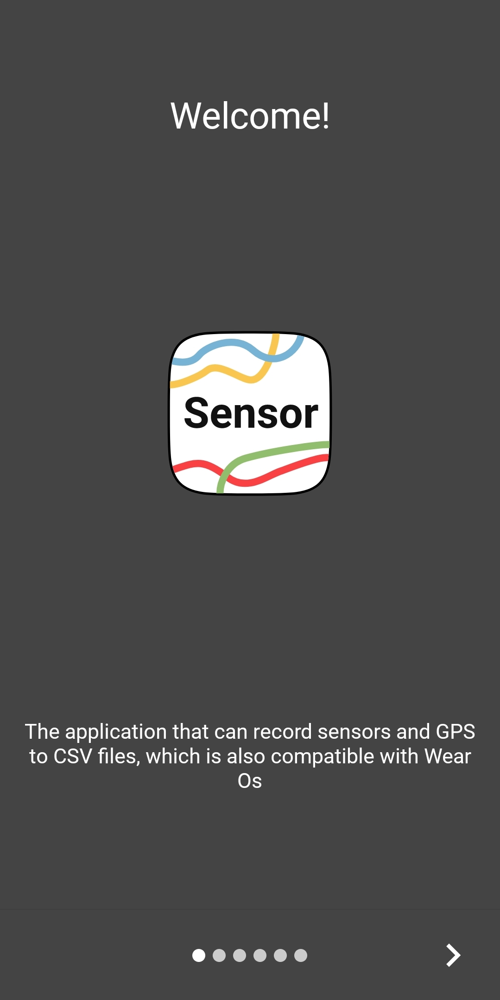
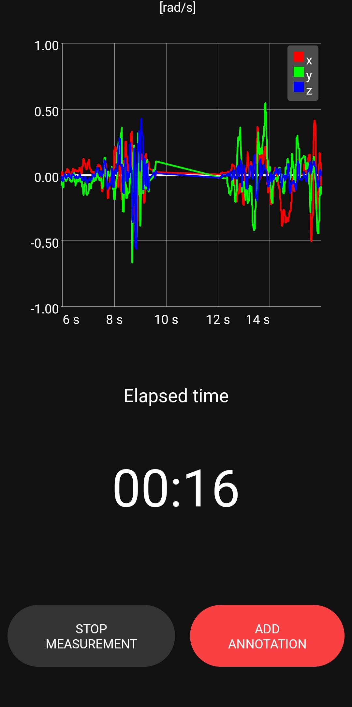
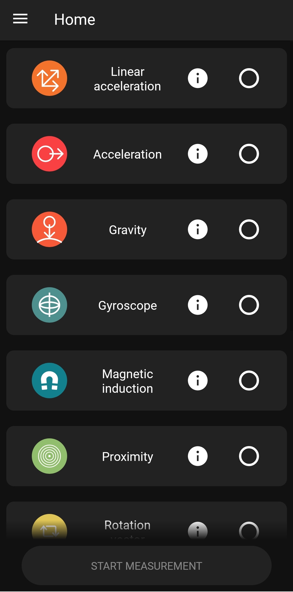
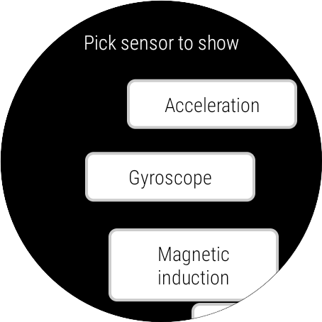
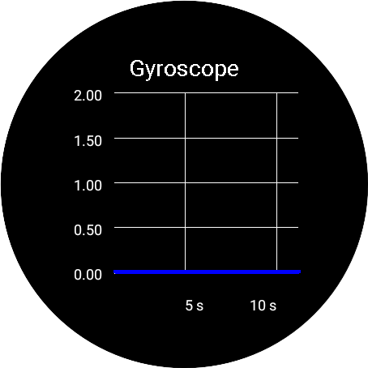

# WearableApplication

The SensorBox Application provides easy way to access sensors in Android phone and Wear Os. You can customize measurements in many ways, which is suitable for development of other apps. 

**Features:**  
Stores sensor outputs into the csv: timestamp, values, accuracy  
Values from the sensors are in raw format  
Compatible with GPS  
Can use Activity recognition API from Android and Significant motion sensor  
Check sensor attributes and preview of the outputs  
Compatible with Wear Os with similar features  

    
  
  
 
 
  

